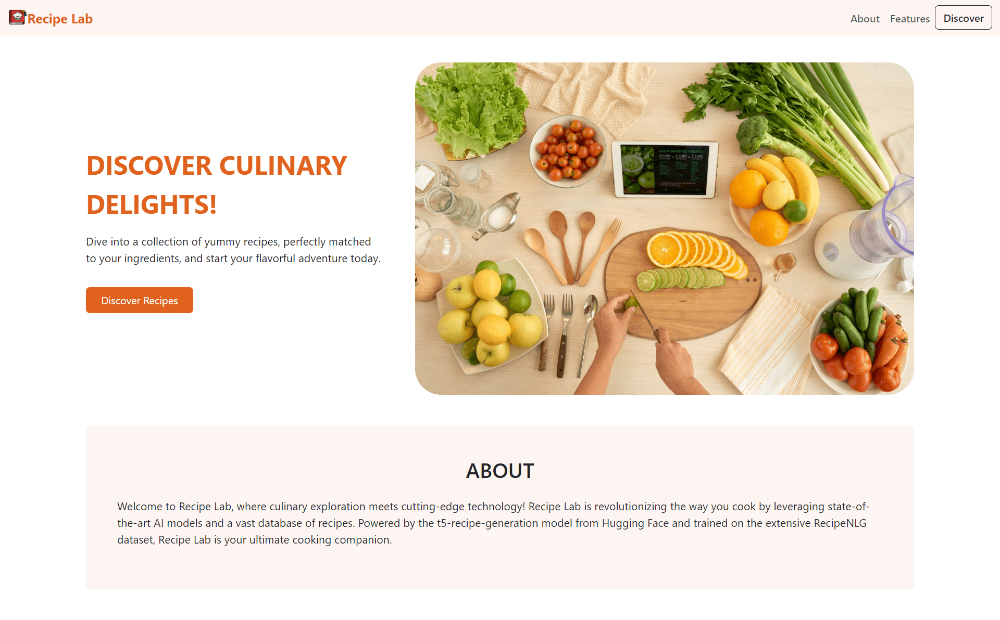
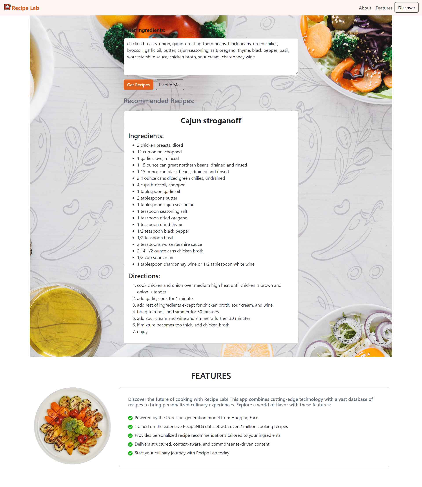

# Recipe Lab

## About Recipe Lab

In a world of endless culinary possibilities, finding the perfect recipe can be overwhelming. Recipe Lab addresses this challenge by providing personalized recipe recommendations tailored to users' ingredients and preferences. Our cutting-edge technology combines a vast recipe database with advanced algorithms to deliver structured, context-aware, and commonsense-driven content.

## Features

- Personalized recipe recommendations based on user preferences and available ingredients.
- User-friendly interface for seamless recipe exploration and discovery.
- Integration with the RecipeNLG dataset, comprising over 2 million cooking recipes.
- Powered by the t5-recipe-generation model from Hugging Face for generating high-quality recipe content.

## Technologies Used

- React
- Vite
- Hugging Face Transformers
- FastAPI
- Uvicorn

## LICENSE

See the [LICENSE](LICENSE) for more information.

## Acknowledgments

- Special thanks to the creators of the RecipeNLG dataset and the t5-recipe-generation model for their valuable contributions to this project.

